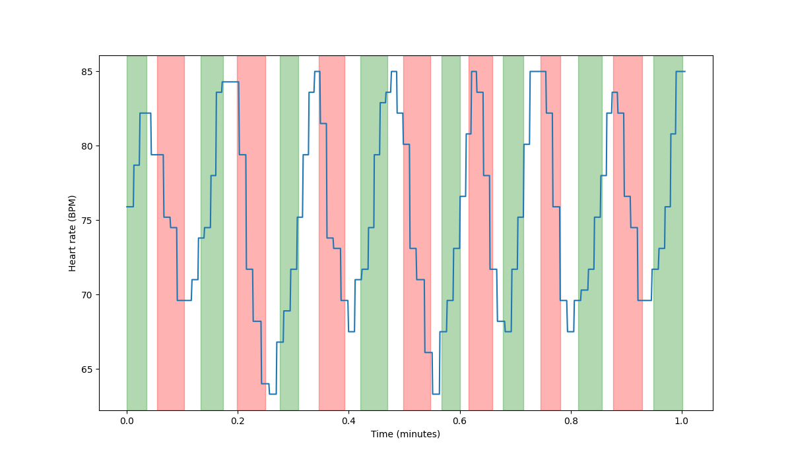

# Heart rate, Heart Rate Variability and breathing recording and real time plotting

Pulse detection with HR sensor and esp32. Data recording and real time plotting (PyQt) using serial connection. Breathing is recorded manually using keyboard.

HR sensor used: https://wiki.seeedstudio.com/Grove-Ear-clip_Heart_Rate_Sensor/

Sensor is detecting heart beats. If more precise RR interval is needed, sensors like AD8232 ECG can be used and modified to the code.

HR calculated as: 60/interval on every pulse detection.

HRV is calculated using 20-second RMSSD.

Sensor based breathing detection TBD once suitable equipment found.

HR, HRV and breathing recording visualization

